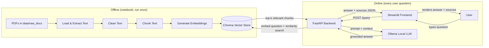

# 📚 Study Assistant — RAG-Powered Document Q&A

A Retrieval-Augmented Generation (RAG) application that answers questions about a set of
study-notes PDFs, grounded in the documents themselves, using a **local Ollama LLM** (no cloud
API, no API key). Built for the Level 2 Summer Training Graduation Project (Core Track).

## Table of contents

- [Overview](#overview)
- [Problem statement](#problem-statement)
- [How the RAG system works](#how-the-rag-system-works)
- [Architecture diagram](#architecture-diagram)
- [Tech stack](#tech-stack)
- [Project structure](#project-structure)
- [Domain & data description](#domain--data-description)
- [Installation](#installation)
- [Ollama setup](#ollama-setup)
- [Running the notebook](#running-the-notebook)
- [Running the backend](#running-the-backend)
- [Running the frontend](#running-the-frontend)
- [Environment variables](#environment-variables)
- [API reference](#api-reference)
- [Evaluation results](#evaluation-results)
- [Screenshots](#screenshots)
- [Troubleshooting](#troubleshooting)
- [Final demo instructions](#final-demo-instructions)
- [Requirements checklist](#requirements-checklist)

## Overview

A user asks a question in a chat-style web interface. The question is sent to a FastAPI
backend, which retrieves the most relevant chunks of text from a locally-built vector database,
sends them together with the question to a local Ollama LLM, and returns an answer that is
**grounded in the retrieved documents**, along with the sources it used.

## Problem statement

General-purpose chatbots answer from their own training data, which means they can
confidently make things up ("hallucinate") when asked about a specific set of documents they
were never trained on. This project solves that for a small, well-defined document set: instead
of asking the LLM to recall facts from memory, we **look up the relevant text first**, and force
the LLM to answer only from what was found — while running entirely locally and free of charge.

## How the RAG system works

1. **Ingest**: PDFs in `data/raw_docs/` are loaded and their text extracted (`pypdf`).
2. **Clean**: extracted text is normalized (whitespace collapsed, trimmed).
3. **Chunk**: cleaned text is split into overlapping ~800-character chunks per document.
4. **Embed**: each chunk is converted into a vector using a local embedding model
   (`sentence-transformers/all-MiniLM-L6-v2`).
5. **Store**: chunk vectors + text + source metadata are persisted in a local **Chroma**
   vector database.
6. **Retrieve**: at question time, the question is embedded the same way, and the most similar
   chunks are looked up from Chroma.
7. **Prompt**: the retrieved chunks are inserted into a prompt template along with the question,
   instructing the LLM to answer only from that context.
8. **Generate**: the prompt is sent to a local **Ollama** model, which returns a grounded answer.
9. **Cite**: the API response always includes the source files/chunks used, independent of what
   the LLM says in its own text.

## Architecture diagram



## Tech stack

| Layer            | Technology                                   |
|-------------------|-----------------------------------------------|
| PDF parsing       | `pypdf`                                       |
| Embeddings        | `sentence-transformers` (`all-MiniLM-L6-v2`)  |
| Vector database   | `chromadb` (persistent, local)                |
| LLM               | `Ollama` (local, e.g. `llama3.2`)             |
| Backend API       | `FastAPI` + `uvicorn`                         |
| Frontend          | `Streamlit`                                   |
| Notebook          | `Jupyter`                                     |
| Testing           | `pytest` + FastAPI `TestClient`               |

## Project structure

```
rag-assistant-project/
├── data/
│   ├── raw_docs/                 # source study-notes PDFs (git-ignored if large)
│   ├── vector_store/             # Chroma store built by the notebook (git-ignored)
│   └── generate_sample_docs.py   # generates the starter sample PDFs
├── notebooks/
│   └── rag_pipeline.ipynb        # full RAG pipeline: load -> ... -> evaluate -> export
├── backend/
│   ├── app/
│   │   ├── main.py                       # FastAPI app, CORS, startup loading
│   │   ├── api/routes/query.py           # GET /health, POST /query
│   │   ├── core/config.py                # settings from .env
│   │   ├── schemas/query.py              # QueryRequest / QueryResponse
│   │   ├── services/retrieval.py         # load vector store, retrieve chunks
│   │   ├── services/generation.py        # build prompt, call Ollama
│   │   └── utils/logging_config.py
│   ├── data/vector_store/        # copy of the persisted store (git-ignored)
│   ├── tests/test_query.py
│   ├── requirements.txt
│   ├── .env.example
│   └── Dockerfile
├── frontend/
│   ├── app.py                    # Streamlit chat UI
│   ├── api_client.py             # wrapper for calling the backend
│   ├── .env.example
│   └── requirements.txt
├── requirements.txt               # for running the notebook
├── .gitignore
└── README.md
```

## Domain & data description

**Domain: Study Assistant.** The starter corpus (`data/raw_docs/`) contains 4 short PDFs of
programming study notes: Python variables & data types, Python functions, data structures
(lists/dicts/sets), and OOP basics. They were generated with `data/generate_sample_docs.py` so
the project works out of the box with real, text-extractable PDFs. You can freely replace or add
your own PDFs (lecture notes, slides exported as PDF, textbook excerpts) as long as they are
text-based rather than scanned images — scanned PDFs would need an OCR step not included here.

## Installation

```bash
git clone https://github.com/<your-username>/rag-assistant-app.git
cd rag-assistant-app

python -m venv .venv
# Windows:
.venv\Scripts\activate
# macOS / Linux:
source .venv/bin/activate

pip install -r requirements.txt          # for the notebook
pip install -r backend/requirements.txt  # for the API
pip install -r frontend/requirements.txt # for the UI
```

> You can also create separate virtual environments per folder if you prefer full isolation —
> a single shared one is simpler for a student project and is what these instructions assume.

## Ollama setup

1. Install Ollama from [ollama.com](https://ollama.com) for your OS.
2. Verify it: `ollama --version`
3. Start the server (often already running as a background service after install):
   `ollama serve`
4. Pull the model used by this project:
   ```bash
   ollama pull llama3.2
   ```
5. Quick sanity check: `ollama run llama3.2 "Say hello"` should print a response.

## Running the notebook

```bash
cd notebooks
jupyter notebook rag_pipeline.ipynb
# In Jupyter: Kernel -> Restart & Run All
```

Expected successful output: the last cells print `Vector store populated with 8 chunks...` and
`Copied vector store to ../backend/data/vector_store`. This step **must be run before** starting
the backend for the first time (and again any time you change the documents or chunking).

## Running the backend

```bash
cd backend
cp .env.example .env      # adjust values if needed
uvicorn app.main:app --reload
```

Expected output: log lines ending with `Application startup complete.` and
`Uvicorn running on http://127.0.0.1:8000`. Open `http://localhost:8000/docs` to try `/query`
directly from the Swagger UI.

Run the tests:
```bash
pytest -v
```
Expected: `3 passed` (health check, happy path, invalid-input 422).

## Running the frontend

```bash
cd frontend
cp .env.example .env      # adjust API_BASE_URL if needed
streamlit run app.py
```

Expected output: a browser tab opens at `http://localhost:8501` showing "📚 Study Assistant"
with a green "Backend is reachable ✅" message in the sidebar (assuming the backend is running).

## Environment variables

**backend/.env**

| Variable                | Default                          | Description                                      |
|--------------------------|-----------------------------------|--------------------------------------------------|
| `VECTOR_STORE_DIR`       | `./data/vector_store`             | Path to the persisted Chroma store                |
| `CHROMA_COLLECTION_NAME` | `study_assistant_docs`            | Chroma collection name                            |
| `EMBEDDING_MODEL_NAME`   | `all-MiniLM-L6-v2`                | Must match the model used in the notebook         |
| `OLLAMA_HOST`            | `http://localhost:11434`          | Ollama server address                             |
| `OLLAMA_MODEL`           | `llama3.2`                        | Ollama model to use for generation                |
| `TOP_K`                  | `4`                                | Number of chunks retrieved per question           |
| `FRONTEND_ORIGINS`       | `http://localhost:8501`           | Comma-separated CORS-allowed origins              |

**frontend/.env**

| Variable        | Default                  | Description                          |
|------------------|----------------------------|---------------------------------------|
| `API_BASE_URL`   | `http://localhost:8000`   | Base URL of the FastAPI backend       |

## API reference

### `GET /health`
Returns `{"status": "ok"}` if the API is reachable.

### `POST /query`

Request body:
```json
{ "question": "What is a variable in Python?" }
```

Response body:
```json
{
  "answer": "A variable is a named container used to store a value in memory. [1]",
  "sources": [
    {
      "source": "python_basics.pdf",
      "chunk_id": "python_basics.pdf::chunk_0",
      "snippet": "A variable in Python is a named container used to store a value..."
    }
  ]
}
```

Empty/missing `question` returns **HTTP 422** (validation error).

### Example curl request

```bash
curl -X POST http://localhost:8000/query \
  -H "Content-Type: application/json" \
  -d '{"question": "What is a variable in Python?"}'
```

## Evaluation results

Full details, including the results table and failure-case analysis, are in
`notebooks/rag_pipeline.ipynb`, Sections 3.10–3.11. Summary: 10 in-scope questions and 2
deliberately out-of-scope questions were tested; all 10 in-scope answers were grounded and
correct against their retrieved sources, and both out-of-scope questions correctly triggered
"I don't have enough information in the documents to answer that" instead of a hallucinated
answer.

## Screenshots

*(Add screenshots of your running app here before submission.)*

- `docs/screenshots/frontend-chat.png` — Streamlit chat interface with an answer and sources
- `docs/screenshots/swagger-ui.png` — `/query` endpoint tested from `/docs`
- `docs/screenshots/notebook-eval.png` — evaluation table from the notebook

## Troubleshooting

| Symptom | Likely cause | Fix |
|---|---|---|
| Backend log: "Vector store loaded but appears EMPTY" | Notebook wasn't run, or vector store wasn't copied to `backend/data/vector_store` | Re-run the notebook top-to-bottom (Section 3.12 copies the store automatically) |
| `ollama.chat(...)` raises a connection error | Ollama isn't running | Run `ollama serve`, confirm with `ollama --version` and `ollama list` |
| Frontend sidebar shows "Backend is NOT reachable" | Backend isn't running, or wrong `API_BASE_URL` | Start the backend first; check `frontend/.env` matches the backend's actual host/port |
| `pip install -r requirements.txt` fails on `chromadb` | Missing build tools / old pip | Upgrade pip (`pip install --upgrade pip`) and retry; on Windows, install "Visual C++ Build Tools" if prompted |
| `/query` returns HTTP 422 | Empty or missing `question` field in the request body | Send a non-empty `question` string |
| Answers look irrelevant to the question | Embedding model mismatch between notebook and backend `.env` | Make sure `EMBEDDING_MODEL_NAME` is identical in both places |

## Final demo instructions

1. Confirm `ollama serve` is running and `ollama list` shows `llama3.2`.
2. Start the backend (`uvicorn app.main:app --reload` inside `backend/`) and confirm
   `http://localhost:8000/health` returns `{"status": "ok"}`.
3. Start the frontend (`streamlit run app.py` inside `frontend/`) and confirm the sidebar shows
   "Backend is reachable ✅".
4. Ask 2-3 in-scope questions (e.g. "What is a variable in Python?") to show grounded, cited
   answers, then ask one clearly out-of-scope question (e.g. "What is the capital of France?")
   to demonstrate the assistant correctly refuses to hallucinate.
5. Optionally, open `notebooks/rag_pipeline.ipynb` to walk through the pipeline and the
   evaluation table.

## Requirements checklist

See the project delivery message for the full requirement-by-requirement checklist
(`Requirement | Implemented? | File/location | How to verify`).
